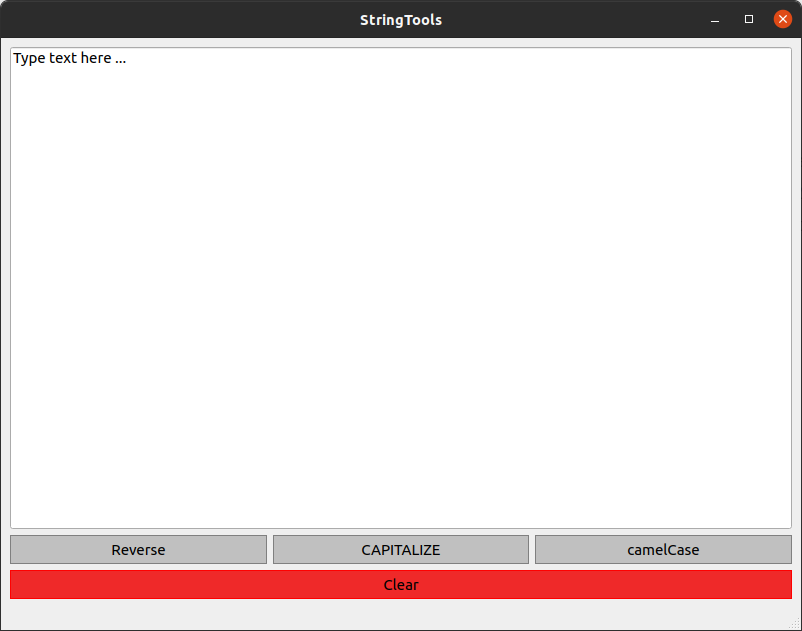

# stringTools_exercise

## Pourpose
This repo contains a small QT5 and C++ project I worked on to familiarize with QT5.

## Functionalities
The program will allow you to reverse, convert in upper case and camel case a text.

Is it also possible to use the following keyboard shortcuts:
- CTRL + 1 to reverse
- CTRL + 2 to capitalize
- CTRL + 3 to convert in camel case
- CTRL + 0 to clear the text field
- CTRL + q to close the program

